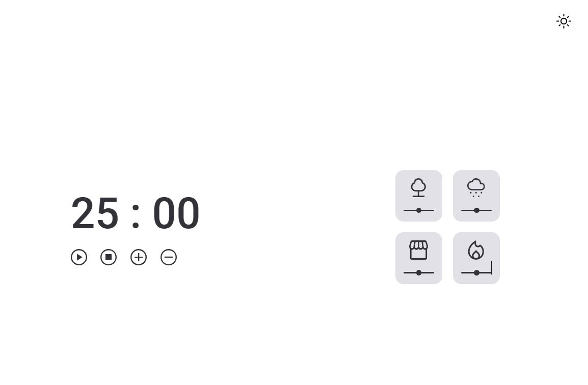
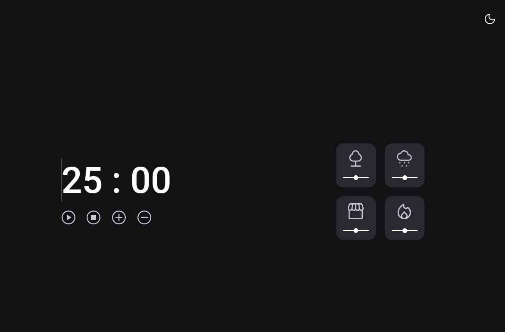

<h1 align="center">FocusTimer - Dark Mode</h1>

Esse desafio tem como objetivo de melhorar o <a src="https://github.com/isabeladuarte/focus-timer-version2">FocusTimer</a>, no qual é necessário, criar versão dark mode e trabalhar com volume dos sons de cada card.

  <a href="#-tecnologias">Tecnologias</a>&nbsp;&nbsp;&nbsp;|&nbsp;&nbsp;&nbsp;
  <a href="#-layout">Layout</a>&nbsp;&nbsp;&nbsp;|&nbsp;&nbsp;&nbsp;
  <a href="#memo-licença">Licença</a>

v1?label=license&message=MIT&color=49AA26&labelColor=000000">

  

  

  

## 🚀 Tecnologias

Esse projeto foi desenvolvido com as seguintes tecnologias:

- HTML, CSS e JS
- Git e Github
- Figma

## 🔖 Layout

Você pode visualizar o layout do projeto através [desse link](https://www.figma.com/file/SOKtQT0zMC53Dokf6KQNEN/Stage-05---Dark-Mode-FocusTimer-(Copy)?type=design). É necessário ter conta no [Figma](https://figma.com) para acessá-lo.

## 📝 Licença

Esse projeto está sob a licença MIT.

---

Feito com ♥ by Isabela